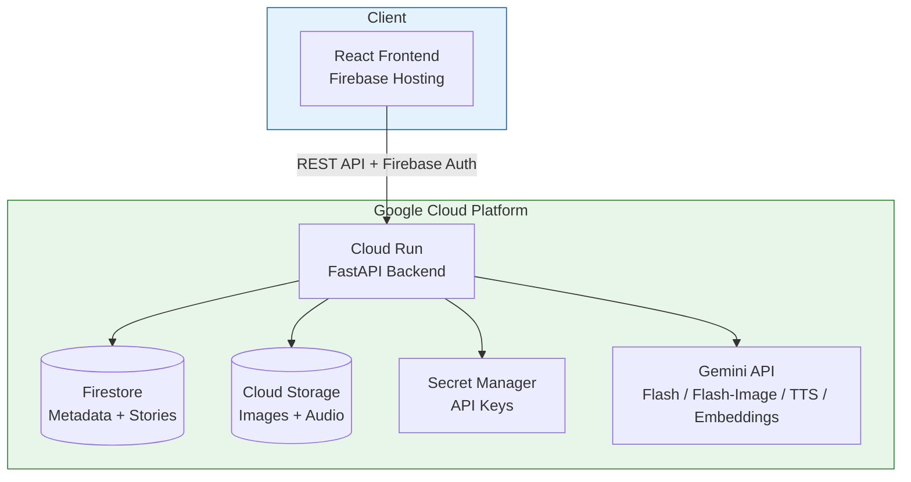
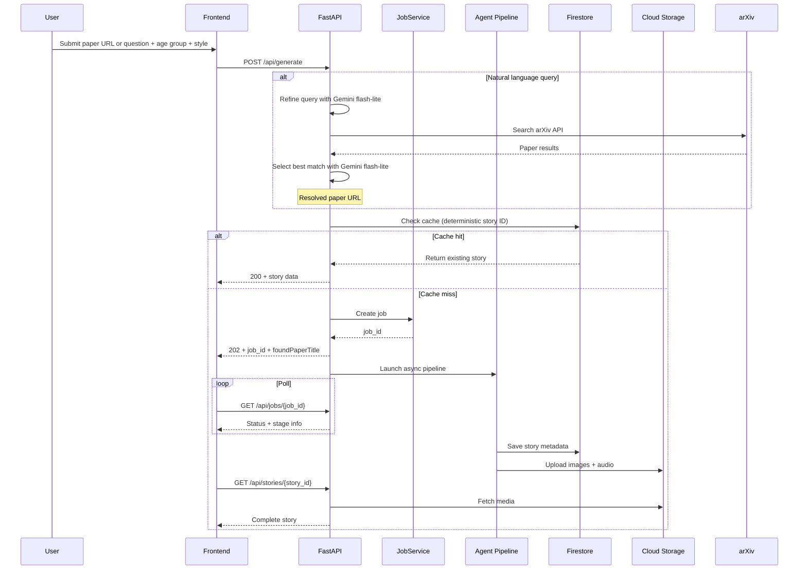
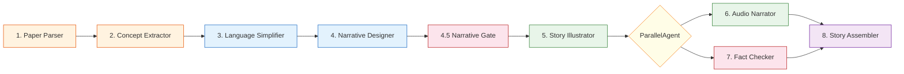
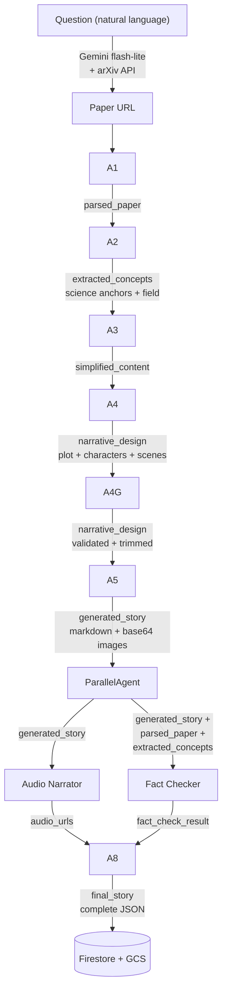

# PaperTales

**AI-powered pipeline that transforms academic research papers into illustrated, narrated stories for young readers.**

PaperTales takes a research paper — via URL or a natural language question like "What is a transformer?" — runs it through a 9-agent AI pipeline, and produces an age-appropriate illustrated story complete with voice narration — making cutting-edge science accessible to children aged 6–17.

Built for the **Gemini Live Agent Challenge — Creative Storyteller Track**, using Google's Agent Development Kit (ADK) and Gemini's interleaved text+image generation capabilities.

## Table of Contents

- [Features](#features)
- [Architecture](#architecture)
- [Pipeline Time Budget](#pipeline-time-budget)
- [Tech Stack](#tech-stack)
- [Getting Started](#getting-started)
- [Deployment](#deployment)
- [Testing](#testing)
- [API Reference](#api-reference)
- [Configuration](#configuration)

## Features

- **Natural language search** — Ask a question (e.g., "How do vaccines work?") and PaperTales finds the best matching arXiv paper automatically via Gemini-powered query refinement
- **Multi-agent pipeline** — 9 specialized AI agents, each handling one stage of the transformation
- **Interleaved text + image generation** — Stories are written and illustrated in a single pass using `gemini-2.5-flash-image`
- **Voice narration** — Age-appropriate TTS narration for every scene
- **Fact-checking** — Embedding-based semantic verification against the source paper
- **Three age groups** — 6–9, 10–13, 14–17 with vocabulary and complexity tuning
- **Four story styles** — Fairy tale, adventure, sci-fi, comic book
- **8 supported archives** — arXiv, bioRxiv, medRxiv, ChemRxiv, SSRN, EarthArXiv, PsyArXiv, OSF
- **Community voting** — Up/down votes with automatic regeneration at quality thresholds
- **Leaderboard** — Top papers by field of study
- **Smart caching** — Deterministic story IDs (`sha256(paper_id:age:style)`) prevent duplicate processing

## Architecture

### High-Level Overview



### Request Flow



### Agent Pipeline

The core of PaperTales is a `SequentialAgent` pipeline built with Google ADK. After the story is written and illustrated, the **Audio Narrator** and **Fact Checker** run in parallel via ADK's `ParallelAgent` — they are independent (both read from `generated_story` but neither reads the other's output). The **Paper Parser** also skips the LLM call entirely when the paper content is cached, emitting the cached text directly.



| # | Agent | Type | Model | Purpose | Tools |
|---|-------|------|-------|---------|-------|
| 1 | **Paper Parser** | `BaseAgent` | `gemini-2.5-flash` (skipped if cached) | Extract and structure paper content from URL | `fetch_paper_from_url` |
| 2 | **Concept Extractor** | `LlmAgent` | `gemini-2.5-flash` | Identify 3–5 science anchors + classify field | — |
| 3 | **Language Simplifier** | `LlmAgent` | `gemini-2.5-flash` | Reduce complexity for target age group | `score_readability` |
| 4 | **Narrative Designer** | `LlmAgent` | `gemini-2.5-flash` | Create plot outline, characters, scene structure | — |
| 4.5 | **Narrative Gate** | `BaseAgent` | — (no LLM) | Truncation + science anchor coverage check | — |
| 5 | **Story Illustrator** | `LlmAgent` | `gemini-2.5-flash-image` | Write story with interleaved text + images | — |
| 6 | **Audio Narrator** | `BaseAgent` | Gemini TTS (no LLM) | Generate voice narration per scene | `get_voice_for_age_group`, `synthesize_speech` |
| 7 | **Fact Checker** | `LlmAgent` | `gemini-2.5-flash` | Verify story accuracy against source paper | `extract_key_claims`, `compare_semantic_similarity`, `compare_claim_coverage` |
| 8 | **Story Assembler** | `LlmAgent` | `gemini-2.5-flash` | Package final JSON + persist to storage | `save_to_firestore`, `upload_to_gcs` |

### State Keys & Data Dependencies

Each agent reads from shared session state (populated by upstream agents) and writes its output to a dedicated state key via `output_key` or `state_delta`. The table below shows the exact state keys each agent depends on, which determines the pipeline execution order.

| # | Agent | Reads (state keys) | Writes (state key) |
|---|-------|-------------------|-------------------|
| 1 | Paper Parser | `user_paper_url`, `paper_cached` | `parsed_paper` |
| 2 | Concept Extractor | `parsed_paper`, `age_group` | `extracted_concepts` |
| 3 | Language Simplifier | `extracted_concepts`, `age_group` | `simplified_content` |
| 4 | Narrative Designer | `simplified_content`, `extracted_concepts`, `story_style`, `age_group`, `story_template` | `narrative_design` |
| 4.5 | Narrative Gate | `narrative_design`, `extracted_concepts` | `narrative_design` (mutated) |
| 5 | Story Illustrator | `narrative_design`, `extracted_concepts`, `story_style`, `age_group`, `scene_count` | `generated_story` |
| 6 | Audio Narrator | `generated_story`, `age_group` | `audio_urls` |
| 7 | Fact Checker | `parsed_paper`, `generated_story`, `extracted_concepts` | `fact_check_result` |
| 8 | Story Assembler | `generated_story`, `audio_urls`, `fact_check_result`, `parsed_paper`, `extracted_concepts` | `final_story` |

> **Parallelization rationale**: Agents 6 and 7 share no read/write dependencies — Audio Narrator reads `generated_story` and writes `audio_urls`, while Fact Checker reads `generated_story` + `parsed_paper` + `extracted_concepts` and writes `fact_check_result`. Only Agent 8 (Story Assembler) needs both outputs, so it runs after the `ParallelAgent` completes.

### Data Flow Diagram



## Pipeline Time Budget

End-to-end story generation takes **3–8 minutes** for a new paper (cache miss). The table below shows estimated wall-clock time per pipeline step and which external services each step depends on.

| # | Agent | Typical Duration | External Calls | Notes |
|---|-------|:----------------:|----------------|-------|
| 1 | Paper Parser | 3–8 s | HTTP fetch (PDF download), Gemini Flash (structuring) | **< 1 s if paper is cached** — skips both download and LLM call |
| 2 | Concept Extractor | 10–20 s | Gemini Flash (concept extraction + field classification) | Two sequential LLM calls (extraction, then field normalization) |
| 3 | Language Simplifier | 10–15 s | Gemini Flash + `score_readability` tool | Readability scoring is local (regex-based Flesch-Kincaid), not an API call |
| 4 | Narrative Designer | 15–25 s | Gemini Flash | Largest prompt — includes story template, simplified content, and concept anchors |
| 4.5 | Narrative Gate | < 1 s | — (no external calls) | Pure logic: truncation to 100K chars + science anchor coverage check |
| 5 | **Story Illustrator** | **90–180 s** | **Gemini Flash Image (interleaved text + image)** | **Bottleneck** — generates 5–6 inline images in a single call |
| 6 | Audio Narrator | 30–60 s | Gemini TTS (one call per scene/section) | Runs **in parallel** with Fact Checker |
| 7 | Fact Checker | 10–20 s | Gemini Flash + Gemini Embeddings (2–3 chunked calls) | Runs **in parallel** with Audio Narrator |
| 8 | Story Assembler | 5–10 s | Gemini Flash + Firestore + GCS upload | Packages JSON, persists metadata + media |
| | **Total (sequential)** | **~3–8 min** | | Parallelization of agents 6 & 7 saves ~30–60 s |

### The Bottleneck: Story Illustrator (Agent 5)

The Story Illustrator is the dominant cost in every pipeline run, accounting for **40–60%** of total wall-clock time. This is inherent to `gemini-2.5-flash-image`'s interleaved text+image generation mode:

- **Single monolithic call** — the model generates all scene text and all illustrations (5–6 images) in one streaming response with `response_modalities=["TEXT", "IMAGE"]`. There is no way to parallelize individual image generation within this call.
- **No tool support** — the image generation model does not support function calling, so the agent cannot use tools to break the work into smaller steps.
- **High output token budget** — configured with `max_output_tokens=65536` and `temperature=0.8` to produce detailed illustrations alongside narrative text.
- **Rate limits** — free-tier Gemini accounts are limited to ~30 image generation requests/day. Under the paid tier, throughput is higher but per-request latency remains the same.

**Mitigations in place:**
- The Narrative Gate (Agent 4.5) caps input to 100K chars (~25K tokens) to stay within the model's 32K input token limit, preventing unnecessarily long prompts that would increase generation time.
- Agents 6 (Audio) and 7 (Fact Check) run in parallel immediately after Agent 5 finishes, overlapping ~30–60 s of work.
- Deterministic story IDs enable aggressive caching — a cache hit returns instantly without re-running the pipeline.

### Timeouts & Retry Configuration

| Setting | Value | Where |
|---------|-------|-------|
| Cloud Run request timeout | 600 s (10 min) | `cloudbuild.yaml` |
| Job service timeout | 15 min | `job_service.py` |
| PDF download timeout | 60 s | `pdf_tools.py` |
| Gemini API retries | 5 attempts, exponential backoff 2–60 s | `config.py` (`RETRY_OPTIONS`) |
| Embedding retries | 5 attempts, exponential backoff 2–60 s | `factcheck_tools.py` |
| arXiv rate limit | 3 s minimum between requests | `paper_search.py` |
| TTS daily limit | Graceful degradation (skips remaining audio) | `audio_narrator.py` |

### Cache Hit Fast Path

When a story already exists for the same `(paper_id, age_group, style)` combination, the pipeline is bypassed entirely:

```
Cache lookup (Firestore) → Return cached story → < 100 ms
```

Cached results do not count against the user's daily quota.

## Tech Stack

| Layer | Technology |
|-------|-----------|
| **AI Framework** | Google ADK (`SequentialAgent`, `ParallelAgent`, `LlmAgent`, `BaseAgent`, `FunctionTool`) |
| **LLM** | Gemini 2.5 Flash, Gemini 2.5 Flash Image, Gemini 2.5 Flash Lite (search) |
| **Embeddings** | `gemini-embedding-001` |
| **TTS** | Gemini 2.5 Flash Preview TTS |
| **Backend** | Python 3.12, FastAPI, uvicorn |
| **Frontend** | React 19, TypeScript, Vite |
| **Auth** | Firebase Authentication (Google, email, anonymous) |
| **Database** | Cloud Firestore |
| **Storage** | Google Cloud Storage |
| **Hosting** | Cloud Run (backend), Firebase Hosting (frontend) |
| **CI/CD** | Cloud Build |
| **PDF Parsing** | pdfplumber, PyMuPDF |

## Getting Started

### Prerequisites

- Python 3.12+
- Node.js 20+
- [uv](https://docs.astral.sh/uv/) (Python package manager)
- Google Cloud SDK (`gcloud`)
- A GCP project with billing enabled
- Gemini API key (paid tier required for image generation)

### Local Development

**1. Clone and install dependencies:**

```bash
git clone https://github.com/<your-org>/paper-tales.git
cd paper-tales

# Backend
cd backend
uv sync
cd ..

# Frontend
cd frontend
npm install
cd ..
```

**2. Set up Google Cloud credentials:**

```bash
gcloud auth application-default login
```

**3. Configure environment variables:**

Create `backend/.env`:
```env
GOOGLE_API_KEY=your-gemini-api-key
CORS_ORIGINS=http://localhost:5173
```

Create `frontend/.env`:
```env
VITE_API_BASE_URL=http://localhost:8000
```

**4. Run locally:**

Using docker-compose:
```bash
docker-compose up
```

Or run separately:
```bash
# Terminal 1 — Backend
cd backend
uv run uvicorn main:app --host 0.0.0.0 --port 8000 --reload

# Terminal 2 — Frontend
cd frontend
npm run dev
```

The frontend runs at `http://localhost:5173` with API requests proxied to the backend at `http://localhost:8000`.

## Deployment

### GCP Services Setup

Before deploying, ensure these GCP services are enabled:

```bash
gcloud services enable \
  run.googleapis.com \
  cloudbuild.googleapis.com \
  firestore.googleapis.com \
  storage.googleapis.com \
  secretmanager.googleapis.com \
  firebase.googleapis.com
```

Store your Gemini API key in Secret Manager:

```bash
echo -n "your-gemini-api-key" | \
  gcloud secrets create google-api-key --data-file=-
```

Deploy Firestore indexes:

```bash
firebase deploy --only firestore:indexes
```

Create the Cloud Storage bucket:

```bash
gcloud storage buckets create gs://papertales-media --location=us-central1
```

### Deploy with Cloud Build (Full Stack)

The `cloudbuild.yaml` handles the complete deployment pipeline:

```bash
gcloud builds submit --project=YOUR_PROJECT_ID
```

This will:
1. Build the backend Docker image
2. Push to Google Container Registry
3. Deploy to Cloud Run (4Gi memory, 2 CPUs, 600s timeout)
4. Build the frontend (`npm ci && npm run build`)
5. Deploy to Firebase Hosting

### Deploy Backend Only (Cloud Run)

```bash
# Build and push
gcloud builds submit ./backend \
  --tag gcr.io/YOUR_PROJECT_ID/papertales-backend

# Deploy
gcloud run deploy papertales-backend \
  --image gcr.io/YOUR_PROJECT_ID/papertales-backend \
  --region us-central1 \
  --platform managed \
  --allow-unauthenticated \
  --memory 4Gi \
  --cpu 2 \
  --timeout 600 \
  --set-secrets GOOGLE_API_KEY=google-api-key:latest
```

### Deploy Frontend Only (Firebase Hosting)

```bash
cd frontend
npm ci && npm run build
cd ..
firebase deploy --only hosting --project=YOUR_PROJECT_ID
```

Firebase Hosting is configured to rewrite `/api/**` requests to the Cloud Run backend service:

```json
{
  "hosting": {
    "rewrites": [
      { "source": "/api/**", "run": { "serviceId": "papertales-backend", "region": "us-central1" } },
      { "source": "**", "destination": "/index.html" }
    ]
  }
}
```

## Testing

The backend has 290+ tests covering agents, tools, API endpoints, and services.

```bash
cd backend

# Run all tests
uv run pytest tests/

# Run with verbose output
uv run pytest tests/ -v

# Run a specific test file
uv run pytest tests/test_api.py -v

# Skip integration tests (no network required)
uv run pytest -m "not integration"

# Run with coverage
uv run pytest tests/ --cov=papertales
```

### Test Structure

| Test File | Coverage |
|-----------|----------|
| `test_api.py` | FastAPI endpoint integration |
| `test_firestore_service.py` | Firestore + GCS persistence |
| `test_job_service.py` | Job lifecycle & timeouts |
| `test_factcheck_tools.py` | Embedding-based fact checking |
| `test_audio_tools.py` | TTS voice selection |
| `test_extract_scene_texts.py` | Scene parsing logic |
| `test_narrative_gate.py` | Quality gate validation |
| `test_paper_search.py` | Natural language search + arXiv API |
| `test_url_validation.py` | URL whitelist validation |
| `test_storage_tools.py` | Storage wrappers |
| `test_pdf_tools.py` | PDF extraction |
| `test_retry_config.py` | Retry logic |
| `test_tools.py` | Tool utility functions |

## API Reference

| Method | Endpoint | Description |
|--------|----------|-------------|
| `GET` | `/health` | Health check |
| `POST` | `/api/generate` | Start story generation (accepts `paper_url` or `query`) |
| `GET` | `/api/jobs/{job_id}` | Poll job status and current stage |
| `GET` | `/api/jobs/active` | Get active job for current user |
| `GET` | `/api/jobs` | List all jobs for current user |
| `GET` | `/api/stories/{story_id}` | Retrieve completed story |
| `GET` | `/api/stories/{story_id}/media/{filename}` | Stream image/audio from GCS |
| `POST` | `/api/stories/{story_id}/vote` | Cast up/down vote |
| `GET` | `/api/quota` | Check remaining daily quota |
| `GET` | `/api/top-papers` | Leaderboard by field (5-min TTL cache) |

All endpoints except `/health` require a Firebase Auth token in the `Authorization: Bearer <token>` header.

### Generate a Story

**From a URL:**

```bash
curl -X POST https://your-app.web.app/api/generate \
  -H "Authorization: Bearer <firebase-token>" \
  -H "Content-Type: application/x-www-form-urlencoded" \
  -d "paper_url=https://arxiv.org/abs/2301.00001&age_group=10-13&style=adventure"
```

**From a natural language question:**

```bash
curl -X POST https://your-app.web.app/api/generate \
  -H "Authorization: Bearer <firebase-token>" \
  -H "Content-Type: application/x-www-form-urlencoded" \
  -d "query=What+is+a+transformer&age_group=10-13&style=sci_fi"
```

When using `query`, the response includes `foundPaperTitle` and `paperUrl` with the resolved arXiv paper.

## Configuration

### Environment Variables

| Variable | Required | Description |
|----------|----------|-------------|
| `GOOGLE_API_KEY` | Yes | Gemini API key (paid tier for image generation) |
| `CORS_ORIGINS` | No | Comma-separated allowed origins (default: `http://localhost:5173`) |
| `PYTHONUNBUFFERED` | No | Set to `1` for unbuffered logs (set in Dockerfile) |
| `VITE_API_BASE_URL` | No | Backend URL for frontend (default: proxied via Firebase Hosting) |

### Supported Paper Archives

| Archive | Example URL |
|---------|-------------|
| arXiv | `https://arxiv.org/abs/2301.00001` |
| bioRxiv | `https://www.biorxiv.org/content/10.1101/...` |
| medRxiv | `https://www.medrxiv.org/content/10.1101/...` |
| ChemRxiv | `https://chemrxiv.org/engage/chemrxiv/article-details/...` |
| SSRN | `https://papers.ssrn.com/sol3/papers.cfm?abstract_id=...` |
| EarthArXiv | `https://eartharxiv.org/repository/view/...` |
| PsyArXiv | `https://psyarxiv.com/...` |
| OSF Preprints | `https://osf.io/preprints/...` |

### Story Options

| Option | Values |
|--------|--------|
| **Age Groups** | `6-9`, `10-13`, `14-17` |
| **Styles** | `fairy_tale`, `adventure`, `sci_fi`, `comic_book` |

### Daily Quotas

| User Type | Stories/Day |
|-----------|-------------|
| Anonymous (guest) | 3 |
| Authenticated | 10 |

## Project Structure

```
paper-tales/
├── backend/
│   ├── papertales/
│   │   ├── agents/           # 9 pipeline agents
│   │   ├── tools/            # PDF, audio, factcheck, storage tools
│   │   ├── config.py         # Models, state keys, field taxonomy
│   │   ├── auth.py           # Firebase token verification
│   │   ├── firestore_service.py  # Firestore + GCS persistence
│   │   ├── job_service.py    # Job lifecycle management
│   │   ├── paper_search.py   # Natural language → arXiv search
│   │   └── url_validation.py # Archive URL whitelist
│   ├── tests/                # 290+ pytest tests
│   ├── main.py               # FastAPI application
│   ├── demo_pipeline.py      # CLI for testing the pipeline
│   ├── Dockerfile            # Cloud Run container
│   └── pyproject.toml        # Python dependencies (uv)
├── frontend/
│   ├── src/
│   │   ├── components/       # React UI components
│   │   ├── pages/            # Route pages
│   │   ├── services/         # API client
│   │   ├── hooks/            # Auth, media, story generation
│   │   └── contexts/         # Theme provider
│   ├── package.json          # Node dependencies
│   └── vite.config.ts        # Dev server + API proxy
├── cloudbuild.yaml           # Full-stack CI/CD pipeline
├── firebase.json             # Hosting + Firestore config
├── firestore.indexes.json    # Composite index definitions
└── docker-compose.yml        # Local development
```

## License

This project was built for the [Gemini Live Agent Challenge](https://ai.google.dev/competition).
