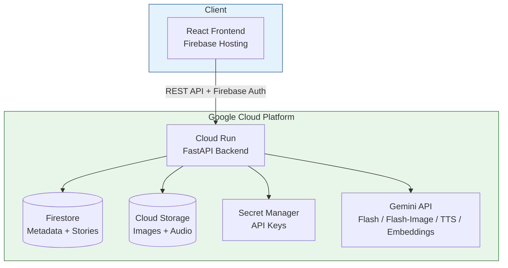
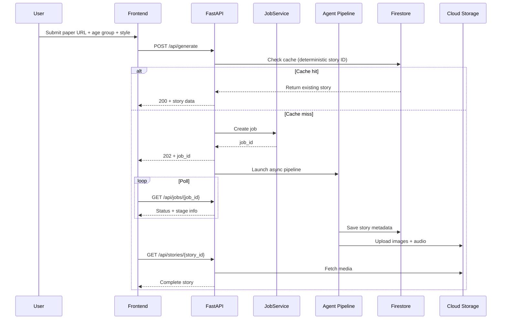
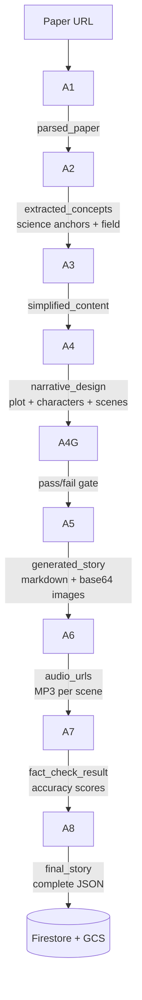

# PaperTales

**AI-powered pipeline that transforms academic research papers into illustrated, narrated stories for young readers.**

PaperTales takes a link to a research paper from any major preprint archive, runs it through a 9-agent AI pipeline, and produces an age-appropriate illustrated story complete with voice narration — making cutting-edge science accessible to children aged 6–17.

Built for the **Gemini Live Agent Challenge — Creative Storyteller Track**, using Google's Agent Development Kit (ADK) and Gemini's interleaved text+image generation capabilities.

## Table of Contents

- [Features](#features)
- [Architecture](#architecture)
- [Tech Stack](#tech-stack)
- [Getting Started](#getting-started)
- [Deployment](#deployment)
- [Testing](#testing)
- [API Reference](#api-reference)
- [Configuration](#configuration)

## Features

- **Multi-agent pipeline** — 9 specialized AI agents, each handling one stage of the transformation
- **Interleaved text + image generation** — Stories are written and illustrated in a single pass using `gemini-2.5-flash-image`
- **Voice narration** — Age-appropriate TTS narration for every scene
- **Fact-checking** — Embedding-based semantic verification against the source paper
- **Three age groups** — 6–9, 10–13, 14–17 with vocabulary and complexity tuning
- **Four story styles** — Fairy tale, adventure, sci-fi, comic book
- **8 supported archives** — arXiv, bioRxiv, medRxiv, ChemRxiv, SSRN, EarthArXiv, PsyArXiv, OSF
- **Community voting** — Up/down votes with automatic regeneration at quality thresholds
- **Leaderboard** — Top papers by field of study
- **Smart caching** — Deterministic story IDs (`sha256(paper_id:age:style)`) prevent duplicate processing

## Architecture

### High-Level Overview



### Request Flow



### Agent Pipeline

The core of PaperTales is a `SequentialAgent` pipeline built with Google ADK. Each agent receives state from the previous agent and passes enriched state forward.

```mermaid
graph LR
    A1[1. Paper Parser] --> A2[2. Concept Extractor]
    A2 --> A3[3. Language Simplifier]
    A3 --> A4[4. Narrative Designer]
    A4 --> A4G[4.5 Narrative Gate]
    A4G --> A5[5. Story Illustrator]
    A5 --> A6[6. Audio Narrator]
    A6 --> A7[7. Fact Checker]
    A7 --> A8[8. Story Assembler]

    style A1 fill:#fff3e0,stroke:#e65100
    style A2 fill:#fff3e0,stroke:#e65100
    style A3 fill:#e3f2fd,stroke:#1565c0
    style A4 fill:#e3f2fd,stroke:#1565c0
    style A4G fill:#fce4ec,stroke:#b71c1c
    style A5 fill:#e8f5e9,stroke:#2e7d32
    style A6 fill:#e8f5e9,stroke:#2e7d32
    style A7 fill:#fce4ec,stroke:#b71c1c
    style A8 fill:#f3e5f5,stroke:#6a1b9a
```



| # | Agent | Model | Purpose | Tools |
|---|-------|-------|---------|-------|
| 1 | **Paper Parser** | `gemini-2.5-flash` | Extract and structure paper content from URL | `fetch_paper_from_url` |
| 2 | **Concept Extractor** | `gemini-2.5-flash` | Identify 3–5 science anchors + classify field | — |
| 3 | **Language Simplifier** | `gemini-2.5-flash` | Reduce complexity for target age group | — |
| 4 | **Narrative Designer** | `gemini-2.5-flash` | Create plot outline, characters, scene structure | — |
| 4.5 | **Narrative Gate** | `gemini-2.5-flash` | Quality validation checkpoint | — |
| 5 | **Story Illustrator** | `gemini-2.5-flash-image` | Write story with interleaved text + images | — |
| 6 | **Audio Narrator** | Gemini TTS | Generate voice narration per scene | `get_voice_for_age_group`, `synthesize_speech` |
| 7 | **Fact Checker** | `gemini-2.5-flash` | Verify story accuracy against source paper | `extract_key_claims`, `compare_semantic_similarity`, `compare_claim_coverage` |
| 8 | **Story Assembler** | `gemini-2.5-flash` | Package final JSON + persist to storage | `save_to_firestore`, `upload_to_gcs` |

### Data Flow Between Agents



## Tech Stack

| Layer | Technology |
|-------|-----------|
| **AI Framework** | Google ADK (`SequentialAgent`, `LlmAgent`, `FunctionTool`) |
| **LLM** | Gemini 2.5 Flash, Gemini 2.5 Flash Image |
| **Embeddings** | `gemini-embedding-001` |
| **TTS** | Gemini 2.5 Flash Preview TTS |
| **Backend** | Python 3.12, FastAPI, uvicorn |
| **Frontend** | React 19, TypeScript, Vite |
| **Auth** | Firebase Authentication (Google, email, anonymous) |
| **Database** | Cloud Firestore |
| **Storage** | Google Cloud Storage |
| **Hosting** | Cloud Run (backend), Firebase Hosting (frontend) |
| **CI/CD** | Cloud Build |
| **PDF Parsing** | pdfplumber, PyMuPDF |

## Getting Started

### Prerequisites

- Python 3.12+
- Node.js 20+
- [uv](https://docs.astral.sh/uv/) (Python package manager)
- Google Cloud SDK (`gcloud`)
- A GCP project with billing enabled
- Gemini API key (paid tier required for image generation)

### Local Development

**1. Clone and install dependencies:**

```bash
git clone https://github.com/<your-org>/paper-tales.git
cd paper-tales

# Backend
cd backend
uv sync
cd ..

# Frontend
cd frontend
npm install
cd ..
```

**2. Set up Google Cloud credentials:**

```bash
gcloud auth application-default login
```

**3. Configure environment variables:**

Create `backend/.env`:
```env
GOOGLE_API_KEY=your-gemini-api-key
CORS_ORIGINS=http://localhost:5173
```

Create `frontend/.env`:
```env
VITE_API_BASE_URL=http://localhost:8000
```

**4. Run locally:**

Using docker-compose:
```bash
docker-compose up
```

Or run separately:
```bash
# Terminal 1 — Backend
cd backend
uv run uvicorn main:app --host 0.0.0.0 --port 8000 --reload

# Terminal 2 — Frontend
cd frontend
npm run dev
```

The frontend runs at `http://localhost:5173` with API requests proxied to the backend at `http://localhost:8000`.

## Deployment

### GCP Services Setup

Before deploying, ensure these GCP services are enabled:

```bash
gcloud services enable \
  run.googleapis.com \
  cloudbuild.googleapis.com \
  firestore.googleapis.com \
  storage.googleapis.com \
  secretmanager.googleapis.com \
  firebase.googleapis.com
```

Store your Gemini API key in Secret Manager:

```bash
echo -n "your-gemini-api-key" | \
  gcloud secrets create google-api-key --data-file=-
```

Deploy Firestore indexes:

```bash
firebase deploy --only firestore:indexes
```

Create the Cloud Storage bucket:

```bash
gcloud storage buckets create gs://papertales-media --location=us-central1
```

### Deploy with Cloud Build (Full Stack)

The `cloudbuild.yaml` handles the complete deployment pipeline:

```bash
gcloud builds submit --project=YOUR_PROJECT_ID
```

This will:
1. Build the backend Docker image
2. Push to Google Container Registry
3. Deploy to Cloud Run (4Gi memory, 2 CPUs, 600s timeout)
4. Build the frontend (`npm ci && npm run build`)
5. Deploy to Firebase Hosting

### Deploy Backend Only (Cloud Run)

```bash
# Build and push
gcloud builds submit ./backend \
  --tag gcr.io/YOUR_PROJECT_ID/papertales-backend

# Deploy
gcloud run deploy papertales-backend \
  --image gcr.io/YOUR_PROJECT_ID/papertales-backend \
  --region us-central1 \
  --platform managed \
  --allow-unauthenticated \
  --memory 4Gi \
  --cpu 2 \
  --timeout 600 \
  --set-secrets GOOGLE_API_KEY=google-api-key:latest
```

### Deploy Frontend Only (Firebase Hosting)

```bash
cd frontend
npm ci && npm run build
cd ..
firebase deploy --only hosting --project=YOUR_PROJECT_ID
```

Firebase Hosting is configured to rewrite `/api/**` requests to the Cloud Run backend service:

```json
{
  "hosting": {
    "rewrites": [
      { "source": "/api/**", "run": { "serviceId": "papertales-backend", "region": "us-central1" } },
      { "source": "**", "destination": "/index.html" }
    ]
  }
}
```

## Testing

The backend has 155+ tests covering agents, tools, API endpoints, and services.

```bash
cd backend

# Run all tests
uv run pytest tests/

# Run with verbose output
uv run pytest tests/ -v

# Run a specific test file
uv run pytest tests/test_api.py -v

# Skip integration tests (no network required)
uv run pytest -m "not integration"

# Run with coverage
uv run pytest tests/ --cov=papertales
```

### Test Structure

| Test File | Coverage |
|-----------|----------|
| `test_api.py` | FastAPI endpoint integration |
| `test_firestore_service.py` | Firestore + GCS persistence |
| `test_job_service.py` | Job lifecycle & timeouts |
| `test_factcheck_tools.py` | Embedding-based fact checking |
| `test_audio_tools.py` | TTS voice selection |
| `test_extract_scene_texts.py` | Scene parsing logic |
| `test_narrative_gate.py` | Quality gate validation |
| `test_url_validation.py` | URL whitelist validation |
| `test_storage_tools.py` | Storage wrappers |
| `test_pdf_tools.py` | PDF extraction |
| `test_retry_config.py` | Retry logic |
| `test_tools.py` | Tool utility functions |

## API Reference

| Method | Endpoint | Description |
|--------|----------|-------------|
| `GET` | `/health` | Health check |
| `POST` | `/api/generate` | Start story generation pipeline |
| `GET` | `/api/jobs/{job_id}` | Poll job status and current stage |
| `GET` | `/api/jobs/active` | Get active job for current user |
| `GET` | `/api/jobs` | List all jobs for current user |
| `GET` | `/api/stories/{story_id}` | Retrieve completed story |
| `GET` | `/api/stories/{story_id}/media/{filename}` | Stream image/audio from GCS |
| `POST` | `/api/stories/{story_id}/vote` | Cast up/down vote |
| `GET` | `/api/quota` | Check remaining daily quota |
| `GET` | `/api/top-papers` | Leaderboard by field (5-min TTL cache) |

All endpoints except `/health` require a Firebase Auth token in the `Authorization: Bearer <token>` header.

### Generate a Story

```bash
curl -X POST https://your-app.web.app/api/generate \
  -H "Authorization: Bearer <firebase-token>" \
  -H "Content-Type: application/x-www-form-urlencoded" \
  -d "paper_url=https://arxiv.org/abs/2301.00001&age_group=10-13&style=adventure"
```

## Configuration

### Environment Variables

| Variable | Required | Description |
|----------|----------|-------------|
| `GOOGLE_API_KEY` | Yes | Gemini API key (paid tier for image generation) |
| `CORS_ORIGINS` | No | Comma-separated allowed origins (default: `http://localhost:5173`) |
| `PYTHONUNBUFFERED` | No | Set to `1` for unbuffered logs (set in Dockerfile) |
| `VITE_API_BASE_URL` | No | Backend URL for frontend (default: proxied via Firebase Hosting) |

### Supported Paper Archives

| Archive | Example URL |
|---------|-------------|
| arXiv | `https://arxiv.org/abs/2301.00001` |
| bioRxiv | `https://www.biorxiv.org/content/10.1101/...` |
| medRxiv | `https://www.medrxiv.org/content/10.1101/...` |
| ChemRxiv | `https://chemrxiv.org/engage/chemrxiv/article-details/...` |
| SSRN | `https://papers.ssrn.com/sol3/papers.cfm?abstract_id=...` |
| EarthArXiv | `https://eartharxiv.org/repository/view/...` |
| PsyArXiv | `https://psyarxiv.com/...` |
| OSF Preprints | `https://osf.io/preprints/...` |

### Story Options

| Option | Values |
|--------|--------|
| **Age Groups** | `6-9`, `10-13`, `14-17` |
| **Styles** | `fairy_tale`, `adventure`, `sci_fi`, `comic_book` |

### Daily Quotas

| User Type | Stories/Day |
|-----------|-------------|
| Anonymous (guest) | 3 |
| Authenticated | 10 |

## Project Structure

```
paper-tales/
├── backend/
│   ├── papertales/
│   │   ├── agents/           # 9 pipeline agents
│   │   ├── tools/            # PDF, audio, factcheck, storage tools
│   │   ├── config.py         # Models, state keys, field taxonomy
│   │   ├── auth.py           # Firebase token verification
│   │   ├── firestore_service.py  # Firestore + GCS persistence
│   │   ├── job_service.py    # Job lifecycle management
│   │   └── url_validation.py # Archive URL whitelist
│   ├── tests/                # 155+ pytest tests
│   ├── main.py               # FastAPI application
│   ├── demo_pipeline.py      # CLI for testing the pipeline
│   ├── Dockerfile            # Cloud Run container
│   └── pyproject.toml        # Python dependencies (uv)
├── frontend/
│   ├── src/
│   │   ├── components/       # React UI components
│   │   ├── pages/            # Route pages
│   │   ├── services/         # API client
│   │   ├── hooks/            # Auth, media, story generation
│   │   └── contexts/         # Theme provider
│   ├── package.json          # Node dependencies
│   └── vite.config.ts        # Dev server + API proxy
├── cloudbuild.yaml           # Full-stack CI/CD pipeline
├── firebase.json             # Hosting + Firestore config
├── firestore.indexes.json    # Composite index definitions
└── docker-compose.yml        # Local development
```

## License

This project was built for the [Gemini Live Agent Challenge](https://ai.google.dev/competition).
